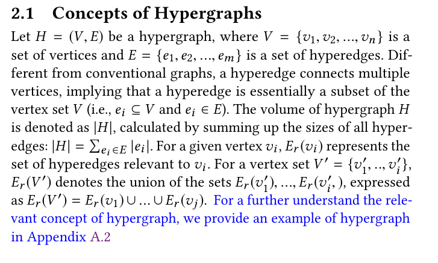

## Response  
Q:   
I can roughly guess the meaning of HC in Equation (2), but for the convenience of other readers, I suggest you provide an intuitive explanation of HC.

A:  
Thanks for your suggestion. We have given a detailed example for  How to calculate partition quality metric HC and $\lambda_{HC}$ in Appendix A2. We hope it can help you and the later reader to better understand these metrics.

## Reference 
None  

## Revision

We have provided a example of hypergraph for a better understanding for reviewers and other readers.   
  

And we specifically noted this example in the Preliminary section.  
  
