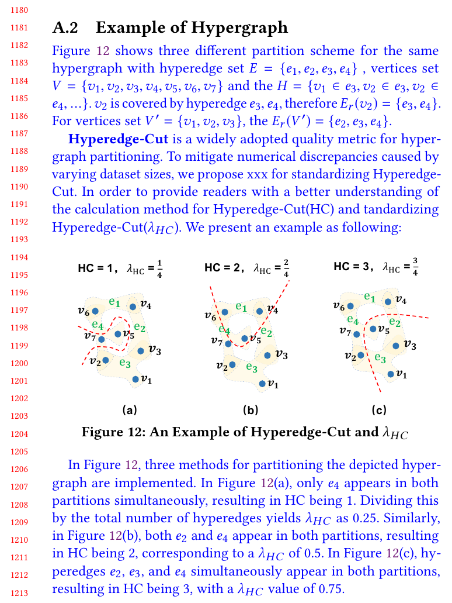

## Reference 
None

## Revision

We have provided a example of hypergraph for a better understanding for reviewers and other readers.
The results indicate that the vast majority of hyperedges has weak correlation or similarity between them.

And we specifically noted this example in the Preliminary section.
