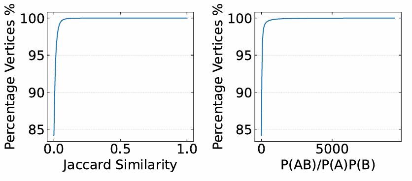

## Reference 
[1] Stell J G. Relations on hypergraphs[C]//International Conference on Relational and Algebraic Methods in Computer Science. Berlin, Heidelberg: Springer Berlin Heidelberg, 2012: 326-341.  
## Revision

We conducted a correlation analysis on the GitHub dataset, randomly selecting any two hyperedges to calculate the correlation and Jaccard similarity between them. The results indicate that the vast majority of hyperedges has weak correlation or similarity between them.
