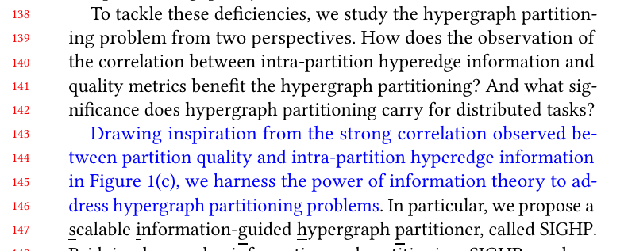
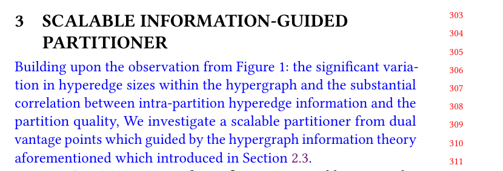

## Response
Q:  
Why does using shared hyperedge information facilitate hypergraph partitioning (Definition 3)? What is the intuitive connection between information theory and graph partitioning?

A:   
The intuitive connection between information theory and graph partitioning lies in that for random event A: two nodes within the same hyperedge belong to the same partition. The quality of partitioning schemes shows a high correlation with the probability of this event occurring as figure 1 (c) shown; In high-quality partitioning schemes, the probability of this event happening is higher. Therefore, from an information theory perspective, we aim to enhance the quality of hypergraph partitioning by increasing the probability of event A.  
To underscore our motivation and rationale more effectively, we have further emphasized the connection between hyperedge information and hypergraph partitioning in Intro and Section 2.3. By doing so, we hope to provide a more comprehensive justification for our approach. 

## Reference 
None
## Revision

We also emphasized the connection between information theory and graph partitioning in three additional places below the article.

