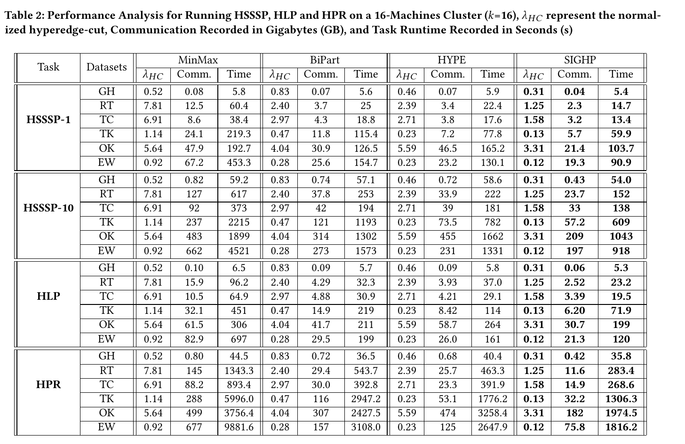

## Reference 
[1] Surana A, Chen C, Rajapakse I. Hypergraph similarity measures[J]. IEEE Transactions on Network Science and Engineering, 2022, 10(2): 658-674.
[2] TUĞAL İ, Zeydin P. Centrality with Entropy in Hypergraphs Based on Similarity Measures[J]. Dicle Üniversitesi Mühendislik Fakültesi Mühendislik Dergisi, 2023, 14(3): 407-419.

## Revision

we present the results of the newly added label propagation algorithm, and compare the performance of HSSSP after increasing the task execution times based on the reviewers' suggestions.

We update corresponding description of task in blue.
