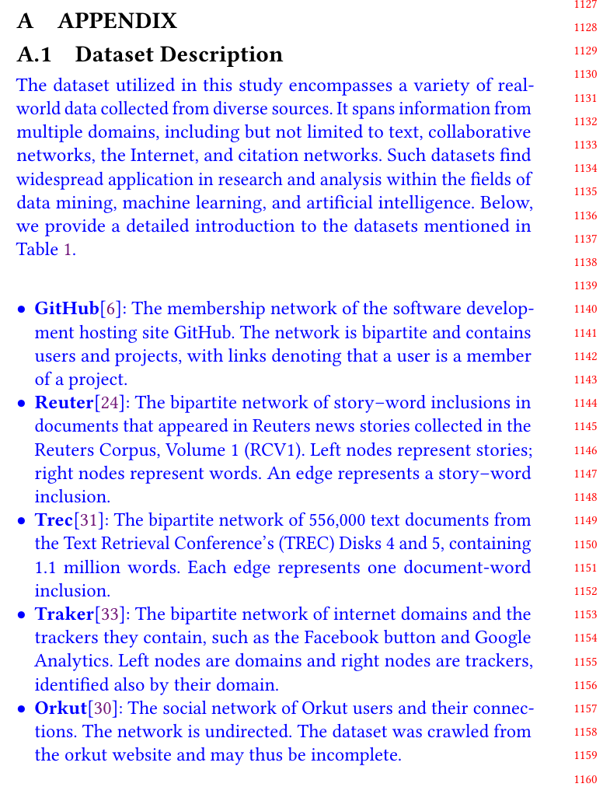

## Response 
Q:  
Why hasn't the effect of different graph sizes on the results of the method been tested?

A:  
Indeed, in our study, we made every effort to explore various data scales, ranging from several megabytes to several gigabytes. By encompassing such a broad spectrum of data sizes, we aimed to provide a comprehensive evaluation of our proposed approach's scalability and performance across different dataset dimensions. Furthermore, we want to highlight that our utilization of the EnWiKi dataset represents a significant contribution to the field.  
To address your confusion regarding the impact of different graph sizes on partitioning algorithms, we have plotted Figure 11 in Appendix A1 to examine the trends of partitioning algorithms under various data scales. We hope this resolves any confusion about the influence of dataset scale on partitioning algorithms.

## Reference 
None

## Revision

Here is the revised content for the detailed description of the dataset in our Appendix. Specifically, we also investigated the changes in partitioning performance of various partitioning algorithms as dataset scales.  
Hope to resolve the reviewers' confusion about our datasets.  

