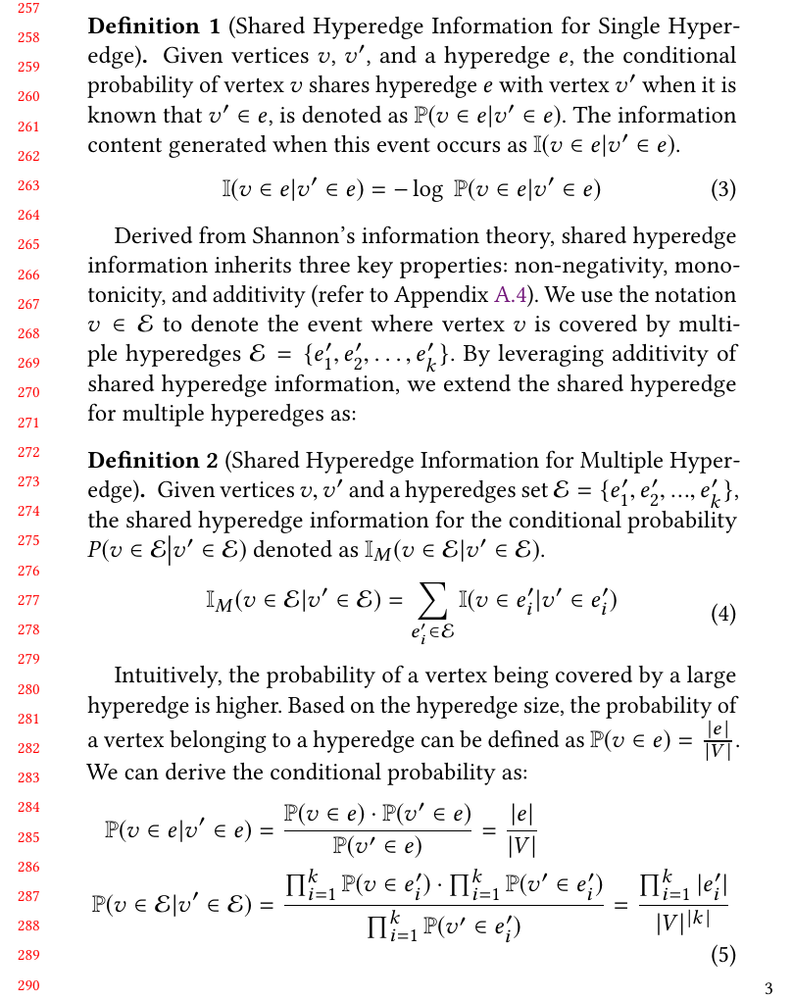

## Reference 
[1] Stell J G. Relations on hypergraphs[C]//International Conference on Relational and Algebraic Methods in Computer Science. Berlin, Heidelberg: Springer Berlin Heidelberg, 2012: 326-341.

## Revision

We have revised the usage of symbols $I$ and $I_M$, replacing them with the symbol $\mathbb{I}$.

