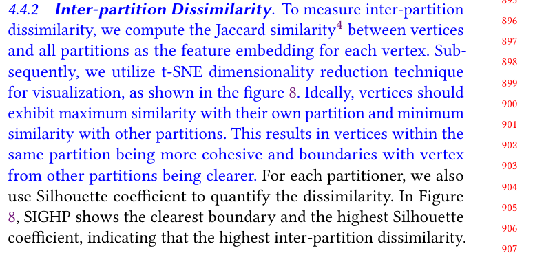

## Response
Q:  
In 4.4.2, is it the similarity vector between vertices of different partitions, or between hyperedges of the vertices of different partitions? The former makes no sense as the partitioning is disjoint.

A:  
Our intention with Figure 8 was to visualize the partitioning results. First, we retrieve high-dimensional embedding vectors of hypergraph vertices. Second, we reduce the vectors to two-dimensional spaces for visualization. To do that, we calculate pairwise similarities of vertex and partitions by Jaccard similarity.
We adopt Jaccard similarity as the node embbeding for the following reasons: Firstly, Jaccard similarity is widely used as a metric for measuring set similarity and hypergraph similarity[1-2]. Moreover, intuitively, a well partitioning scheme should ensure that nodes maintain significant differences from other partitions(Otherwise, it means there are many cross-partition connections). Therefore, we choose the Jaccard similarity vector between nodes and all partitions as the feature representation of nodes, and measure the dissmilarity of partitions by observing the visualied nodes distribution.

## Reference 
None

## Revision

We have provided a more detailed explanation and revision of the similarity calculation between nodes and partitions.

