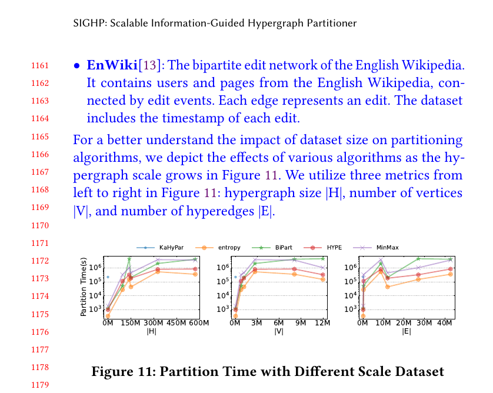

## Response
Q:  
Is the data truly hypergraph data?  

A:  
Certainly, the hypergraph data utilized in our study is authentic and reflects real-world scenarios. Detailed explanations about vertices and hyperedges for each dataset are provided in Appendix A1, along with a comprehensive overview of each dataset. This in-depth discussion aims to enhance the understanding of the dataset characteristics and experimental settings.   

## Reference 
None

## Revision

Here is the revised content for the detailed description of the dataset in our Appendix. Hope to resolve the reviewers' confusion about hypergraph data.  

