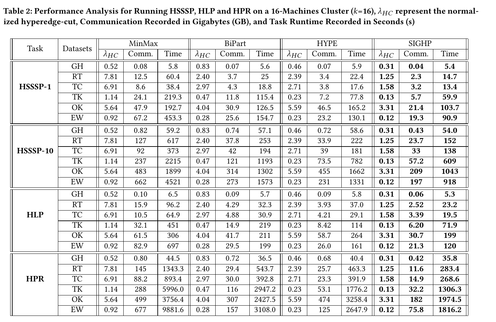
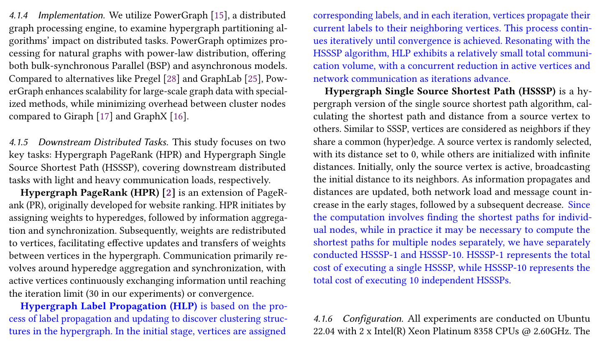

## Response
Q:  
Is it possible to increase the number of tasks?

A:  
We are somewhat unclear about the term 'number of tasks'. We can not only increase the quantity of the same task but also the variety of tasks.  
If your concerns are on hypergraph tasks other than HSSSP and HPR, we have included the label propagation algorithm which widely used in community detection and node classification. We believe that the inclusion of the label propagation algorithm enriches the diversity of our experimental setup and contributes to a more thorough understanding of hypergraph partitioning methodologies.   
If your concerns are on the scalability of multi-run hypergraph tasks, we have done additional experiments by expanding the original HSSSP experiments to HSSSP-1 and HSSSP-10 to represent the total communication overhead and time overhead required to run a single HSSSP and 10 independent runs of HSSSP, respectively, and the results of the experiments show that the cumulative advantage of SIGHP will continue to grow as the number of runs increases.  
We hope to have addressed your concerns and are committed to addressing any additional issues you may have.  

## Reference 
[1] Surana A, Chen C, Rajapakse I. Hypergraph similarity measures[J]. IEEE Transactions on Network Science and Engineering, 2022, 10(2): 658-674.  
[2] TUĞAL İ, Zeydin P. Centrality with Entropy in Hypergraphs Based on Similarity Measures[J]. Dicle Üniversitesi Mühendislik Fakültesi Mühendislik Dergisi, 2023, 14(3): 407-419.  

## Revision

we present the results of the newly added label propagation algorithm, and compare the performance of HSSSP after increasing the task execution times based on the reviewers' suggestions.

We update corresponding description of task in blue.

