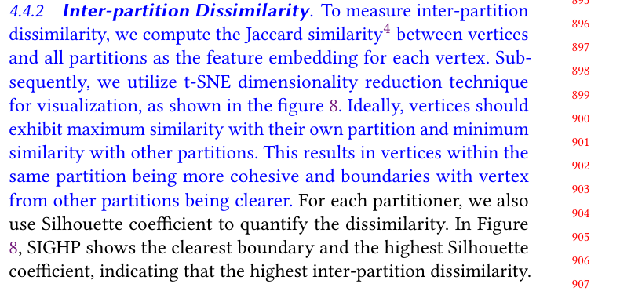

## Response
Q:  
In Figure 8 of tsne representation, why does the embedding point change and not just the partition?

A:  
We perform node embedding after partitioning is completed. The embedding result depending on the partitioning quality.  We retrieve high-dimensional embedding vectors of hypergraph vertices. Then, we use t-SNE to reduce the vectors to two-dimensional spaces for visualization.

## Reference 
None

## Revision

We have provided a more detailed explanation and revision of the similarity calculation between nodes and partitions.

