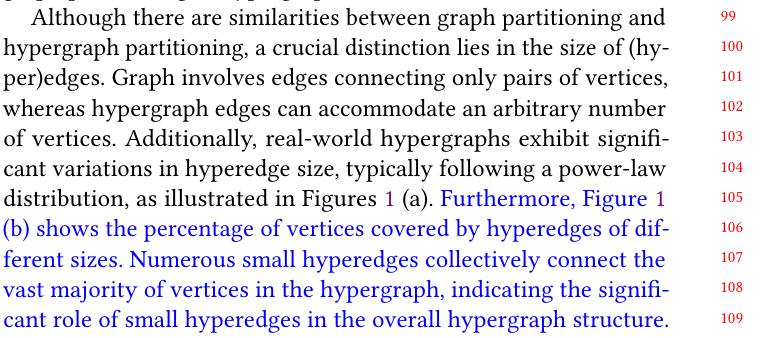
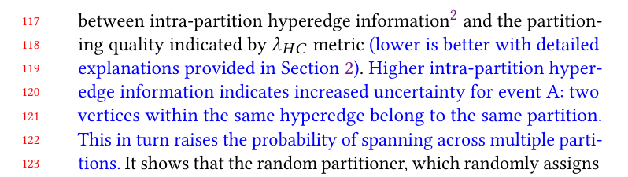

## Response
Q:   
Figure 1 lacks self-explanation. The meanings of "related vertex percentage" and "intra-part information" are not clearly inferred from the caption or introduction.

A:  
for your feedback. We will provide detailed explanations of relevant vertex percentages and additional internal information in the introduction section to ensure that readers have a clearer understanding of the background and objectives of our research. 

## Reference
None

## Revision

We have provided a more detailed explanation of several points raised by the reviewers in the following locations.

