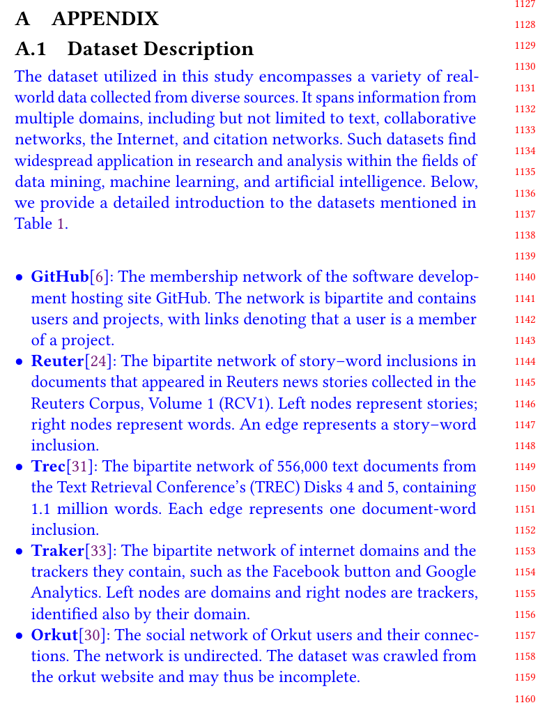
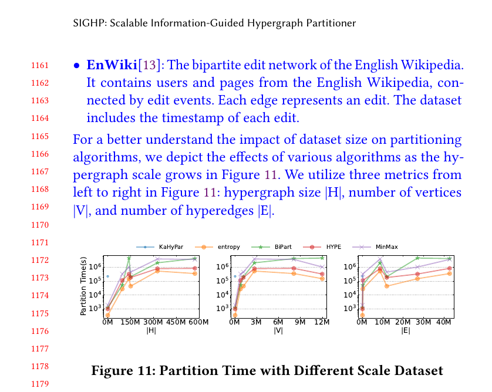

## Response
Q:  
Could the authors describe how each dataset (i.e., hypergraph) is constructed? What do nodes and hyperedges represent?

A:  
Thanks for the suggestion. We have added explanations about our datasets in the appendix to clarify the hypergraph's construction and descriptions.

## Reference 
None

## Revision

Here is the revised content for the detailed description of the dataset in our Appendix. Hope to resolve the reviewers' confusion about hypergraph data.

