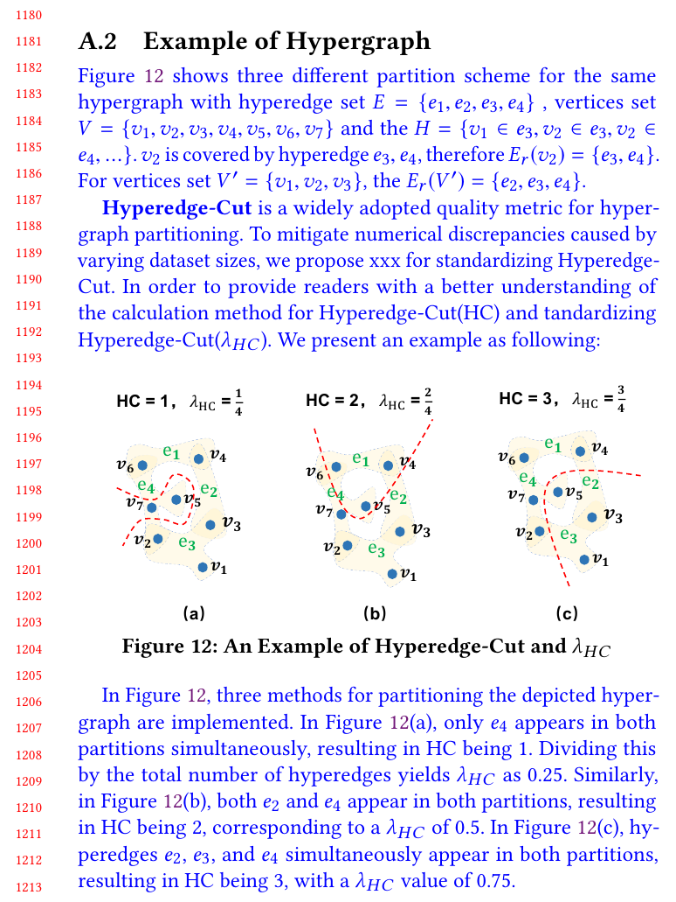
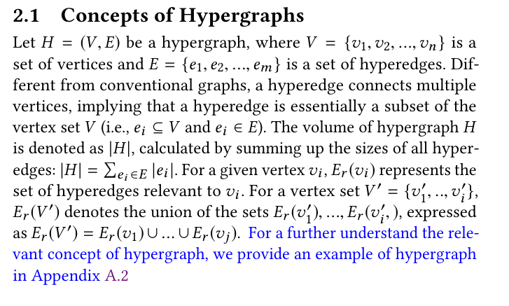

## Response
Q:  
Clarifying the intuition behind the hyperedge-cut (HC) in Eq. (2) could improve readability.

A:  
Thanks for your suggestion. We have given a detailed example for  How to calculate partition quality metric HC and $\lambda_{HC}$ in Appendix A2. We hope it can help you and the later reader to better understand these metrics.

## Reference 
None

## Revision

We have provided a example of hypergraph for a better understanding for reviewers and other readers.   

And we specifically noted this example in the Preliminary section.  

